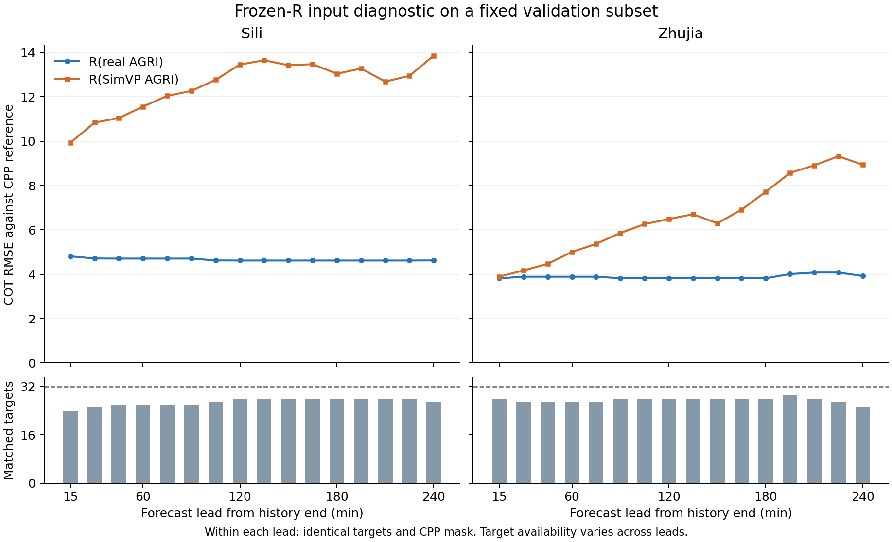

# 固定目标 COT 真实/外推输入诊断结果（2026-09-08）

已完成一次 CPU 诊断和独立保存数组审计。在预先固定的 validation 样本中，使用 SimVP 外推 AGRI 的冻结 R 检索误差高于使用真实 AGRI；同 872 配对的 CPP-reference COT RMSE 为 **4.293596 → 10.131402**。两站各 16/16 时效的 COT MAE/RMSE、log1p MAE/RMSE 均为外推输入较差。

这项结果说明该输入替换下的参考检索误差退化，不能单独解释 GHI 小头负收益，也不证明 COT 普遍无效。既有 8 次 original/QC1 GHI pilot 保持原样；未读取 test、未计算本诊断的 GHI 指标、未重训 S/R。

## 同配对口径

每个可用站点/target/lead 的原有效像元参与池化，同一 target 跨 lead 重复计权；两支完全相同的参考和 mask。COT 无量纲，以下不是 W/m²。

|范围|配对数|有效像元贡献|真实输入 COT RMSE|外推输入 COT RMSE|
|---|---:|---:|---:|---:|
|全部|872|219310|4.293596|10.131402|
|四里|431|109984|4.659453|12.608411|
|竺家|441|109326|3.890978|6.780822|

同一池化口径的 COT MAE 为 2.121013 → 5.376300；log1p RMSE 为 0.463342 → 0.908917。另列 58 个唯一真实目标的描述性 RMSE 为 4.287924（14571 个有效像元），不能把它与上表重复计权的 forecast 汇总直接比较。

## 全时效展示

横轴为历史末帧之后 +15～+240 min。每个站点/lead 内两支目标与掩膜相同；不同 lead 可配对目标不同，不能把曲线变化全部归因于时效。下排显示匹配目标数，虚线为各站最初固定的 32 个目标。图中连接线只呈现逐 lead 描述性指标，未进行跨缺口产品插值或显著性检验。

全部 32 组 MAE/RMSE/bias/log1p 指标和计数见 [CSV](../figures/cot_pair_diag_20260908_v2/all_station_leads.csv)，[PDF](../figures/cot_pair_diag_20260908_v2/cot_reference_rmse_by_lead.pdf) 可导出；[独立复核](COT_PAIR_RESULTS_REVIEW_20260908.md) 包含完整逐 lead 表。

## 协议与复核范围

- 在读取 COT 预测/误差前冻结每站全部 R validation 唯一 UTC target 的 32 个等间隔排序位置。原样保留 64 目标、872 配对、152 缺 lead 和 6 个完全缺 forecast 的目标，没有根据误差、天气或 CPP 值换样本。
- 58 目标的原文件、修正 sidecar 与冻结 S 静态网格片坐标逐值相同；872 配对三几何共 669696 个元素差 0。两支只替换 13 AGRI，R 权重、train norm、几何、参考与 mask 相同。
- 两支均 CPU float32、2 线程、batch32、eval/no_grad；不足批重复末项后丢弃填补输出，真实端算一次后复用。耗时 18.607 秒。沿用训练的归一化后非有限值填 0 规则，实际两支填补均为 0；无裁剪。
- 参考沿用 R pack 中 float32 target×float32(100)，先恢复 physical COT，再用 float64 评价；未新加筛选或改 mask。
- 完整保存预测、参考、mask 和键，再读回计算。独立 NumPy 审计复算 635 项指标，最大差 0，满足原 1e-10 门；872 键、selected source reference/mask、重复 real 数组逐值相同。独立审计没有重新运行模型，不能称独立完整前向复现。
- CPP 是参考产品；source NC 生成批次与生成 checkpoint 的关联仍未闭合。R 曾在此 validation 选模；872 配对并非 872 个独立观测，未进行统计显著性或正式时间 test。

## 数值和执行记录

207626 的旧 GPU cache 数值 warning 保留：重放旧设置 max log1p 差 0.001033306 大于先定 0.001；关闭 benchmark/cuDNN TF32 的 GPU 与 CPU 差 4.053e-6。两个开关一起改变，不能单独归因 TF32。本诊断两支均重新 CPU 推理，不采用旧 GPU COT，故没有混合后端；它也不关闭旧 cache 的门。

诊断 v1 在 checkpoint 中相对 pack 路径解析处停止，尚未计算 COT 误差。保留失败报告与原脚本快照；v2 仅将该相对路径按工程根解析，协议、模型、样本、批量与数值口径不变。协议原定 v1 输出位置因此保留为失败尝试，完整结果写入独立 v2，没有覆盖重跑。

原始报告/NPZ 的 UTC 字符串均为 +00:00；PowerShell ConvertFrom-Json 会把时间转成本地 DateTime。查看应使用 Python json 或 -DateKind String，不应据显示的 +08:00 修改数据。

## 服务器证据与后续判定

服务器根：`/public/home/slfu/ttzhou/swc/irradiance_forecast/SolarCOTIFS_20260907`。

- 完整输出：`/public/home/slfu/ttzhou/swc/irradiance_forecast/SolarCOTIFS_20260907/audits/cot_pair_diag_20260908_v2/report.json` 及同目录 `cot_pair_predictions_20260908_v1.npz`。
- 独立审计：`/public/home/slfu/ttzhou/swc/irradiance_forecast/SolarCOTIFS_20260907/audits/cot_pair_results_audit_20260908.json`。
- 协议：`docs/COT_PAIR_DIAGNOSTIC_PROTOCOL_20260908.md`，SHA `74a94abda6c1b7054b26baf586bf3b7e2e94fe62c71efc2ac5a0f3ee3998ccf5`。
- 完整报告 SHA：`8fa50c03f3077e29c59a77dfe93e1e85ba6b572971c9dccff83b0c12001cc928`；独立审计 SHA：`d0693805cfa6bc5e95d90e13fb09a1c21d80ab4bb76be6b994c7e500c02f9d76`。
- 可复现绘图脚本 `scripts/render_cot_pair_diagnostic.py`；图表 source/output SHA 见 `figures/cot_pair_diag_20260908_v2/manifest.json`。图表不重跑模型。

科学放行判定由单独 [Result-to-Claim 复审](COT_PAIR_RESULT_TO_CLAIM_20260908.md) 记录；数值审计通过不自动批准正式扩展。后续执行统一读取 [小时交接](HOURLY_NEXT_ACTIONS_20260908.md)。此页为工程诊断，未把 pilot 提升为双语论文最终结论。
