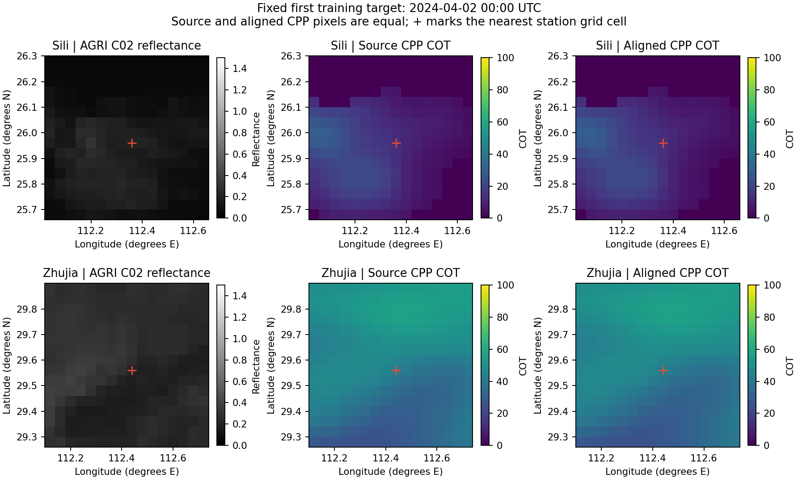

# COT 区域与实际像元复查结果（2026-09-08）

每小时任务已按用户最新要求改为优先审计区域与实际输入链。本轮固定 12 个 train/validation 样本，未发现下游湖南区域、站点互换、行列、转置/翻转或一像元裁剪错误。**这不等于原始 CPP 在生成时的地理注册已被证实**：实际 NetCDF writer、生成批次与模型输入时刻绑定仍缺失，不能排除源文件把错误像元与正确经纬度一起写入。

本轮未修改数据、mask、norm 或 checkpoint，未训练、未读 test/GHI。先前 GHI 负收益不变，也不能仅凭本轮未查出错误就认定其原因。

## 已实际检验的链

|检查|范围|结果|
|---|---|---|
|原CPP NC → 独立经纬度索引 → 修正sidecar|12样本、8个唯一源NC|全部源可读；轴坐标差0，COT与NaN位置逐值一致|
|sidecar → 参考mask与R target|同12行，2735有效参考像元|既有mask、float32 COT/100逐值一致|
|full AGRI → Combined站点片|12行×20通道，两台服务器|对应片及非有限模式逐值一致|
|Combined → R实际输入|12行×16通道|13AGRI+3几何逐值一致；独立重建再读取R行复核通过|
|FD/HPC full与aux|同12行|整图小halo、目标几何、有效位一致；UTC/BJT路径合同正确|
|最近站点像元|四里、竺家|均为16×16片的[8,8]，独立另一算法复算相同|
|原始HDF → full AGRI|固定首train时刻，两站×C02/C13，共4片|依真实HDF row/col及LUT还原值与full逐值一致；aux有效位一致|

无变换的对应片使用精确比较，不通过增大容差使其通过。AGRI的固定非零±1偏移、转置/翻转等13项替代不等于对应原片；CPP的这些替代违反声明的地理坐标对应，不按“误差更小”选择新位置。float32 COT÷100再×100最大3.814697e-6仅为舍入，不是空间偏移。

独立复核程序未导入生产映射、mask或pack函数。CPP从保存的源轴/像元/sidecar/pack小数组独立重算；AGRI从保存FD源片独立重建后实际读取HPC的12个R行。它们并非再次遍历全量源文件。原HDF主检查没有全文件hash，只用aux绑定的source size/mtime及前后稳定性，保存DN/标定值/索引等小数组；其绝对导航精度仍不是本轮独立校准对象。

原HDF见证另由独立程序仅读同一文件的CAL02/CAL13两张LUT（共8192个值）及必要属性，再使用已经保存的DN还原4片；值与主检查calibrated/full及另一份独立Combined片均精确相等，有效位一致，无新DN读取。LUT首次检查因大端float32与本机dtype比较失败，保留原尝试后修正为检查4-byte浮点类型；没有放宽数值阈值或修改源数据。

## 区域、站点和索引没有混用

湖南full网格256×256，纬度22.28～32.48°、经度106.44～116.64°；全局规则网格crop为 rows[1213,1469)、cols[2061,2317)，含区域云场上下文。它比行政省界大不能单独作为裁错证据。

|站点|full AGRI零基片|CPP零基片（LAT/LON网格）|最近格点经纬度|格点距站点|原HDF中心行列|
|---|---|---|---|---|---|
|四里|rows[155,171), cols[140,156)|rows[1368,1384), cols[2201,2217)|25.9600°N,112.3600°E|1.81 km|[694,1554]|
|竺家|rows[65,81), cols[142,158)|rows[1278,1294), cols[2203,2219)|29.5600°N,112.4400°E|1.22 km|[612,1549]|

站点坐标来自权威工程schema，不是本轮新的地面测量。CPP是4051×4051经纬度重网格产品；其行列不等于FY4B原始HDF行列。以前Combined保存的旧CPP矩形比正确片偏一像元，但当前修正sidecar与本次实际读取的R训练包使用上表正确映射，不能把旧字段当作新模型仍在用的矩形。

此图固定展示两站首个训练目标，未按结果选图；红十字为最近站点格点。AGRI与CPP是不同物理量，不能凭图案相似程度判断标定或位移。图中的源CPP与修正CPP相等只证明下游读取一致；不证明NC生成时地理标签一定正确。

## 全部固定样本

每站×train/validation按UTC排序取首、中、末。12行均保留，没有因缺源或结果替换，未涉及test。

|站点|split|R行号|UTC目标|有效参考像元|源COT与sidecar最大差|
|---|---|---:|---|---:|---:|
|sili|train|0|2024-04-02T00:00:00Z|256|0.0|
|sili|train|3005|2025-01-04T03:00:00Z|256|0.0|
|sili|train|6010|2025-06-30T10:30:00Z|157|0.0|
|sili|validation|6011|2025-06-30T22:30:00Z|18|0.0|
|sili|validation|7633|2025-08-04T05:00:00Z|256|0.0|
|sili|validation|9256|2025-09-22T06:15:00Z|256|0.0|
|zhujia|train|9257|2024-04-02T00:00:00Z|256|0.0|
|zhujia|train|12240|2025-01-04T04:00:00Z|256|0.0|
|zhujia|train|15223|2025-06-30T10:30:00Z|256|0.0|
|zhujia|validation|15224|2025-06-30T22:30:00Z|256|0.0|
|zhujia|validation|16868|2025-08-04T02:15:00Z|256|0.0|
|zhujia|validation|18513|2025-09-22T06:15:00Z|256|0.0|

## 尚未排除的上游问题

目前看到的相邻COT训练程序保存权重和预测数组，并未找到它创建这些Result/CPP NC的调用链；另有不同通道/上限的候选实现。NC声明COT(LAT,LON)，纬度81→-81、经度24→186，但没有内嵌时间、生成脚本或checkpoint绑定。文件名UTC匹配不等于模型实际输入时刻已被追溯。

因此不能排除实际writer曾对像元转置/翻转/错一格后仍写正确LAT/LON，或文件名与输入时刻不同。需要具体生成脚本及配置/批次日志，能将某个已审计NC关联到输入L1文件、裁剪/重投影/拼接步骤和生成checkpoint。已向用户询问该服务器路径；不会进入无权限私有目录，也不据目录邻近或文件owner猜测生产归属。

下一小时优先处理实际producer线索或用户新路径。已有12行payload通过后不重复跑同一检查；只有定位明确错误才另名修复并判断受影响范围，随后按原预算公平复跑。新的纯空间猜测不能直接触发全量重建或训练。

## 工程证据与执行记录

服务器根：`/public/home/slfu/ttzhou/swc/irradiance_forecast/SolarCOTIFS_20260907`。

- [固定计划](COT_SPATIAL_REAUDIT_PLAN_20260908.md)；audits/cot_spatial_reaudit_selection_20260908_v1.json。
- [CPP源像元报告](CPP_SPATIAL_PAYLOAD_REVIEW_20260908.md)；audits/cpp_spatial_payload_20260908_v1_hyperslab.json/.npz。
- [AGRI实际输入报告](AGRI_SPATIAL_PAYLOAD_REVIEW_20260908.md)；audits/agri_spatial_payload_20260908_v1_fd.json/.npz、_hpc.json。
- [源生成器地理绑定审计](CPP_PRODUCER_GEOMETRY_REVIEW_20260908.md)。
- 独立重算：audits/cpp_spatial_independent_recheck_20260908_v1.json、agri_spatial_independent_recheck_20260908_v1.json。
- 静态/原HDF：audits/station_grid_contract_20260908_v1.json、cot_raw_hdf_witness_20260908_v1/、agri_spatial_payload_20260908_v1_peer_review.json及agri_spatial_payload_20260908_v1_peer_lut_review.json/.npz。

CPP首次源检查被中断，尚无完整样本结果，原因未确诊；读取方式改成同坐标的基本切片并另存完整结果，未改数据/模型。独立CPP检查器一处轴数组未显式broadcast导致形状断言，原脚本与失败说明保留，修正后全12行逐值比较通过。原HDF脚本的输出目录防覆盖检查已加强，原实际运行source snapshot保留并与原报告SHA绑定；未因此重跑该实验。这些是检查工具执行记录，不是论文方法贡献。
